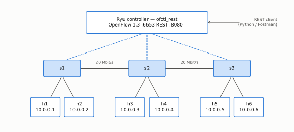
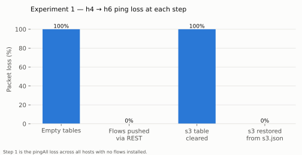
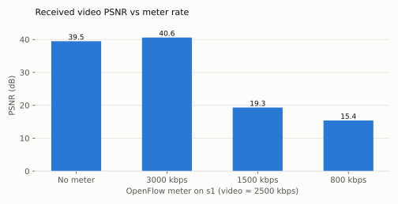
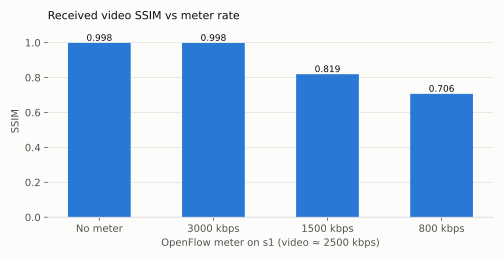
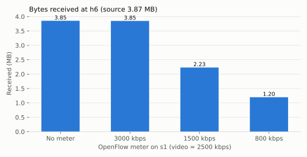
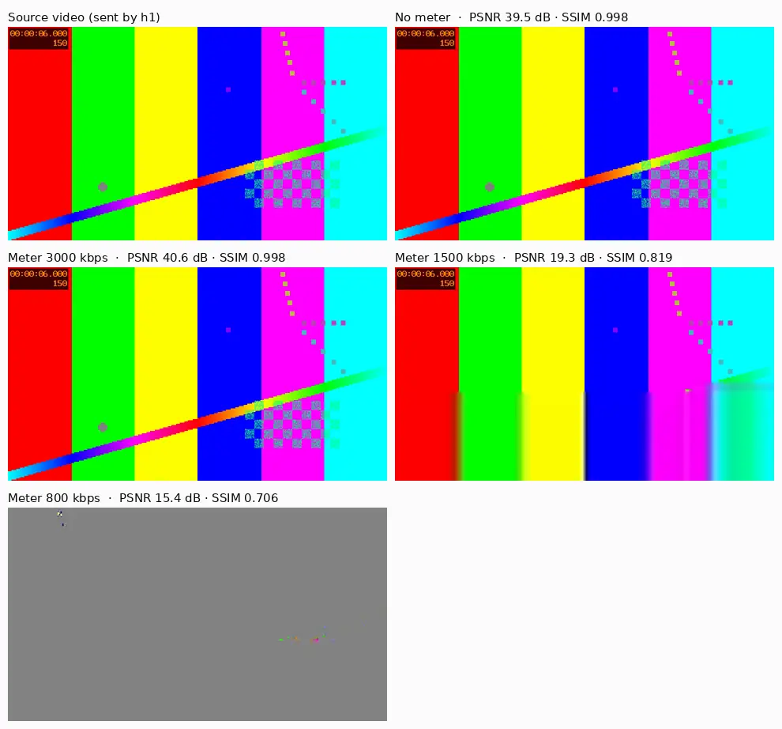

# SDN Lab — OpenFlow Automation & Video Streaming Control

**Project author and sole implementer:** Mohammed Mahyoub.

A software-defined network built with **Mininet**, **Open vSwitch** and the **Ryu** controller. Every forwarding decision is pushed to the switches through the controller's **REST API**; no switch is configured by hand. The lab runs two experiments, and every number below comes from the run logs committed in [`results/`](results).

1. **Configuration automation.** The flow tables are programmed over REST. One switch's table is then wiped, and the switch is restored from a saved JSON definition in milliseconds.
2. **Video streaming under controller policy.** An H.264 video is streamed across the network while the controller enforces an OpenFlow 1.3 **meter**. Received quality (PSNR / SSIM) is measured at four rate limits; the only change between runs is one value in Python.

**Stack:** Mininet 2.3 · Open vSwitch 3.3 (OpenFlow 1.3) · Ryu 4.34 `ofctl_rest` · Python · REST / Postman · FFmpeg (H.264, MPEG-TS over UDP) · Linux HTB

---

## Contents

- [Topology](#topology)
- [Repository layout](#repository-layout)
- [Experiment 1 — configuration automation over REST](#experiment-1--configuration-automation-over-rest)
- [Experiment 2 — video streaming under an OpenFlow meter](#experiment-2--video-streaming-under-an-openflow-meter)
- [How to run it](#how-to-run-it)
- [Design notes](#design-notes)

---

## Topology

<p align="center"></p>

- **Switches:** three OpenFlow 1.3 switches in a line, with two hosts on each.
- **Links:** host links are shaped to 100 Mbit/s and the inter-switch trunks to 20 Mbit/s, using Linux HTB.
- **Controller:** Ryu runs only the `ofctl_rest` application. It has no learning-switch logic, so a switch forwards nothing unless a rule has been pushed to it over REST.

| Host | IP | Switch |
|---|---|---|
| h1, h2 | 10.0.0.1–2 | s1 |
| h3, h4 | 10.0.0.3–4 | s2 |
| h5, h6 | 10.0.0.5–6 | s3 |

---

## Repository layout

```
sdn-lab/
├── topology/sdn_topo.py               Mininet topology (OpenFlow 1.3, TCLink, remote controller)
├── automation/
│   ├── ryu_rest.py                    REST client for Ryu ofctl_rest (logs every call)
│   ├── flow_builder.py                derives each switch's flow table from the live topology
│   ├── flows/s1.json · s2.json · s3.json   generated flow tables (replayable from Postman / curl)
│   └── sdn-lab.postman_collection.json     the same operations as a Postman collection
├── experiments/
│   ├── run_lab.py                     runs Experiment 1 and 2 end to end
│   └── make_figures.py                builds the charts in docs/images from results.json
├── results/
│   ├── results.json                   all measured values
│   └── logs/                          REST call log, flow-table dumps, ping output, meter stats
├── setup.sh · start_controller.sh     environment setup and controller start
└── docs/images/                       figures used in this README
```

---

## Experiment 1 — configuration automation over REST

**Goal:** program an entire network from one place, then recover a switch that has lost its configuration without touching the switch itself.

`flow_builder.py` reads the live topology and computes each switch's flow table:

- **ARP:** `eth_type 0x0806` → `FLOOD` (priority 100).
- **Unicast:** `eth_dst = <host MAC>` → the output port toward that host (priority 200).

The tables are saved to `automation/flows/*.json` and pushed with `POST /stats/flowentry/add`.

```python
# automation/flow_builder.py (excerpt)
for h in net.hosts:
    entries.append({"dpid": dpid, "table_id": 0, "priority": 200,
                    "match": {"eth_dst": h.MAC()},
                    "actions": [{"type": "OUTPUT", "port": _port_toward(net, sw, h)}]})
```

### Results

| Step | Action (REST) | Result |
|---|---|---|
| 1 | Switches connected, tables empty | `pingAll`: **100 % loss** — nothing is forwarded |
| 2 | 21 × `POST /stats/flowentry/add` (all three switches, 0.038 s) | `pingAll`: **0 % loss**; h4 → h6: 0 % loss |
| 3 | `DELETE /stats/flowentry/clear/3` | h4 → h6: **100 % loss** |
| 4 | Replay `flows/s3.json` (7 calls, **0.008 s**) | h4 → h6: **0 % loss**, connectivity restored |

<p align="center"></p>

Captured output (`results/logs/exp1_ping_after_*.txt`):

```
mininet> h4 ping -c 3 h6          # after DELETE /stats/flowentry/clear/3
3 packets transmitted, 0 received, 100% packet loss, time 2030ms

mininet> h4 ping -c 3 h6          # after replaying automation/flows/s3.json
64 bytes from 10.0.0.6: icmp_seq=1 ttl=64 time=0.433 ms
64 bytes from 10.0.0.6: icmp_seq=2 ttl=64 time=0.347 ms
64 bytes from 10.0.0.6: icmp_seq=3 ttl=64 time=0.376 ms
3 packets transmitted, 3 received, 0% packet loss, time 2049ms
```

s3 flow table after the restore (`GET /stats/flow/3`, from `results/logs/exp1_s3_flows_restored.json`):

```
prio=200  dl_dst=00:00:00:00:00:01..04  → OUTPUT:3   (toward s2)
prio=200  dl_dst=00:00:00:00:00:05      → OUTPUT:1   (h5)
prio=200  dl_dst=00:00:00:00:00:06      → OUTPUT:2   (h6)
prio=100  dl_type=0x0806 (ARP)          → OUTPUT:FLOOD
```

The complete request/response log of the run is in `results/logs/rest_calls.jsonl` (48 calls).

---

## Experiment 2 — video streaming under an OpenFlow meter

**Goal:** show that the controller alone can decide how much bandwidth a video flow gets, and measure what that does to the picture the viewer receives.

**Setup:**

- h1 streams a 12-second, 640×360, 25 fps H.264 video. It is about 2500 kbit/s, has 300 frames and is 3.87 MB in total.
- The stream goes to h6 as MPEG-TS over UDP. It crosses s1 → s2 → s3.

**What the controller does each run:**

1. Installs meter 1 on s1, a `DROP` band at the chosen rate (`POST /stats/meterentry/add`).
2. Adds a priority-300 flow, matching UDP to h6 port 5004, that sends the packets through the meter.

**How quality is measured:** FFmpeg compares the recording made at h6 with the source and reports PSNR and SSIM.

The only line that changes between runs:

```python
METER_RATES_KBPS = [None, 3000, 1500, 800]   # None = no meter (baseline)
```

### Results

| Meter on s1 | Received at h6 | Packets dropped by meter | Frames decoded | PSNR | SSIM |
|---|---|---|---|---|---|
| none | 3.85 MB | — | 299 / 300 | **39.5 dB** | **0.998** |
| 3000 kbps | 3.85 MB | 0 | 298 / 300 | 40.6 dB | 0.998 |
| 1500 kbps | 2.23 MB | 1,271 | 299 / 300 | 19.3 dB | 0.819 |
| 800 kbps | 1.20 MB | 2,105 | 293 / 300 | 15.4 dB | 0.706 |

<p align="center">


</p>
<p align="center"></p>

The same moment of the video (t = 6 s), as received at h6 in each run:

<p align="center"></p>

**Reading the results:**

- **No meter / 3000 kbps.** A meter above the stream's bitrate drops nothing, and the received video matches the source. The small PSNR gap between these two runs is frame-alignment noise from the first frame.
- **1500 kbps.** The meter discards about 42 % of the bytes. Every frame still arrives, but slices are lost and the decoder smears the picture (SSIM 0.82).
- **800 kbps.** The meter drops 2,105 packets (≈ 2.76 MB) and the picture collapses into grey concealment frames (PSNR 15.4 dB).
- **Policy from the controller only.** The meter rate is the single variable across the four runs. It was set entirely from the controller, with no change on the hosts or the video.

Meter counters read back from the controller (`GET /stats/meter/1`, 800 kbps run):

```json
{ "meter_id": 1, "flow_count": 1, "packet_in_count": 3069, "byte_in_count": 3994366,
  "band_stats": [ { "packet_band_count": 2105, "byte_band_count": 2756318 } ] }
```

---

## How to run it

These steps are for Ubuntu 22.04 or 24.04, as root. They also work in a VM or WSL2.

```bash
git clone https://github.com/Mahyoub88/sdn-openflow-lab && cd sdn-openflow-lab
sudo bash setup.sh                    # Mininet, Open vSwitch, FFmpeg, Ryu (Python 3.9 venv)
sudo bash start_controller.sh &       # Ryu ofctl_rest: OpenFlow :6653, REST :8080
sudo python3 experiments/run_lab.py   # runs Experiment 1 and 2, writes results/
python3 experiments/make_figures.py   # rebuilds the charts
```

To drive the controller by hand, import `automation/sdn-lab.postman_collection.json` into Postman. It contains requests to:

- list the switches;
- dump and clear s3's flow table;
- restore each of s3's entries;
- add a meter and read its statistics.

For an interactive network, run `sudo python3 topology/sdn_topo.py`.

## Design notes

- **Userspace datapath.** The switches run Open vSwitch in userspace (`datapath=user`), so the lab works on hosts without the openvswitch kernel module. Because that datapath does not complete veth checksum offload, the topology disables TX/RX offload on every host interface (`disable_offload()`). Without that, UDP video packets arrive with bad checksums and are dropped.
- **Ryu version.** Ryu 4.34 does not run on Python 3.12+, so it runs in its own Python 3.9 environment. The lab itself runs on the system Python.
- **Proactive flows only.** All forwarding state is proactive and lives in the controller's flow definitions. A switch that loses its table can be rebuilt from `automation/flows/<switch>.json` on its own, without touching the rest of the network.

---

**Author:** Mohammed Mahyoub · [Portfolio](https://mahyoub88.github.io/) · [LinkedIn](https://www.linkedin.com/in/mohammed-mahyoub/) · [ORCID](https://orcid.org/0009-0003-5640-352X) · MIT License
