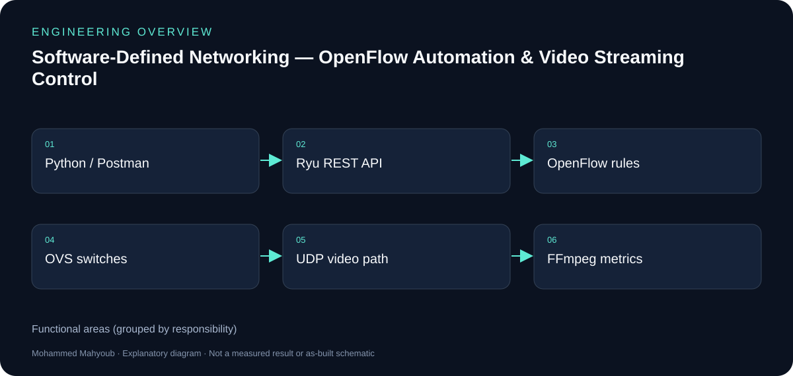
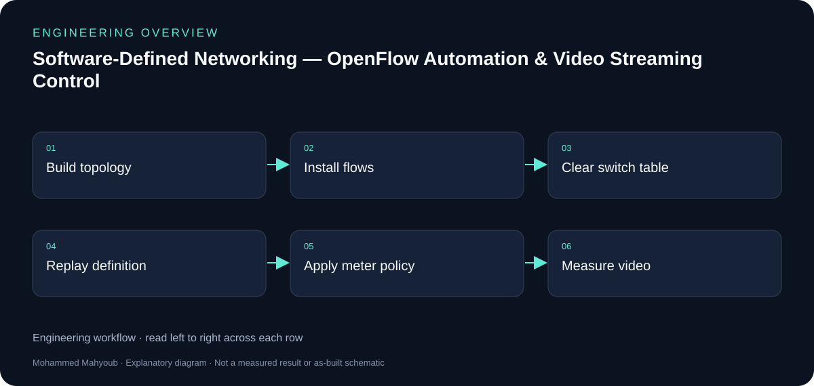

# Software-Defined Networking — OpenFlow Automation & Video Streaming Control — Engineering Guide

Built an SDN lab with Mininet, Open vSwitch (OpenFlow 1.3) and the Ryu controller, programmed entirely through the controller REST API: flow tables are generated and installed automatically, and OpenFlow meters control the quality of a live video stream.

## Visual overview

*New explanatory diagram; grouped responsibilities, not an as-built schematic or test result.*

*New explanatory workflow; a documentation aid, not evidence that every proposed check was performed.*

## Original and reproducible implementations

The LinkedIn project describes an OpenDaylight implementation using XML-defined rules, Mininet and a connection to a real IP network. This repository documents a reproducible Ryu implementation using ofctl_rest, Open vSwitch and OpenFlow 1.3. The controller names and API formats must remain attached to their respective implementations.

## Control plane versus data plane

Python or Postman sends configuration requests to the controller. OpenFlow rules and meters then govern forwarding inside the switches. Video packets travel through the switch path; they do not pass through the REST client.

## Evidence behind the results

The committed results and logs describe 21 REST calls for initial installation, seven calls for s3 restoration, and four video-meter conditions. The chart values belong to those recorded runs. REST request duration is not an independently measured end-to-end service recovery time.

## Interpretation

An OpenFlow DROP meter above the stream bitrate produces little impairment; lower rates discard packets and reduce received PSNR and SSIM. This is policing behaviour, not adaptive video encoding or guaranteed quality for arbitrary networks.

## Evidence to review or collect

The following are suggested review checks. A checklist entry is not a claimed pass result.

- Switch connections and installed flow tables.
- Connectivity before/after clearing s3.
- REST log and replayed definition.
- Meter counters and aligned video-quality results.

## Source gallery

*exp1 h4 h6 loss.*

*exp2 frames t6s.*

*exp2 psnr.*

*exp2 received.*

*exp2 ssim.*

*topology.*

## Sources and provenance

- [Published portfolio description](https://mahyoub88.github.io/#proj-sdn).
- [Project README](../README.md) and existing repository files.
- [LinkedIn projects](https://www.linkedin.com/in/mohammed-mahyoub/details/projects/): supplementary descriptions and project media.
- New SVG figures and explanatory text were authored for this documentation update; they are not original photographs or new measured results.
