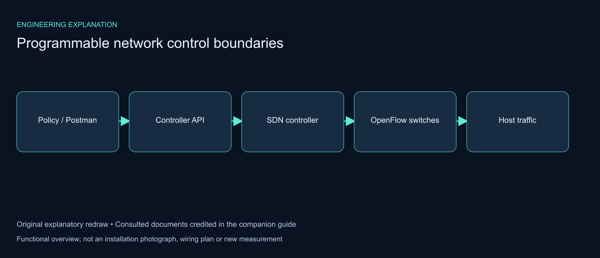

# Programmable network control boundaries

## From policy request to packet forwarding

The reference report explains the separation between the control plane and the forwarding plane, then illustrates an OpenDaylight/Mininet environment with Postman and XML flow requests. An application or operator expresses a policy through the controller interface; the controller translates that policy into forwarding behavior on the connected switches. User traffic then follows the installed forwarding rules.

Three observations should remain separate: an API request was accepted, the intended rule appeared in the switch, and traffic actually followed the intended path. A controller response alone is insufficient evidence of end-to-end forwarding. The documentation should connect the request, installed state and observable host traffic.

## Explaining the original system and this extension

| Aspect | Original implementation described in this repository | Reproducible extension |
|---|---|---|
| Controller | OpenDaylight | Ryu ofctl_rest |
| Automation representation | Postman and XML forwarding rules | REST requests and JSON flow definitions |
| Forwarding environment | Mininet/OpenFlow and real-IP integration | Mininet/Open vSwitch topology |
| Results attribution | Original implementation evidence | Committed extension run logs and derived charts |

## Verification sequence

1. Confirm controller-to-switch connectivity and the discovered topology.
2. Record the policy request and response.
3. Inspect the installed flow state, including match, priority and action.
4. Generate the intended host traffic and inspect connectivity or application behavior.
5. Change or restore the policy and compare the observed forwarding state.

This sequence is an explanatory method, not an additional experiment run. No figures or performance measurements from the consulted report are presented as new results of this repository.

## Reference and reuse note

Consulted local reference: **SDN_Nassmah .pdf — Performance Study of SDN, Sana’a University; credited to Nassmah Yahya Al-Matari, supervised by Dr. Mohammed Al-Olofi; implementation discussion in chapter 5 and XML/Postman examples in appendix B.**

This guide uses original wording and a newly drawn diagram to explain relevant engineering ideas. The reference document and its photographs are not republished here. Source authors retain their attribution. Project implementation evidence and existing measured results remain in the main repository documentation.
